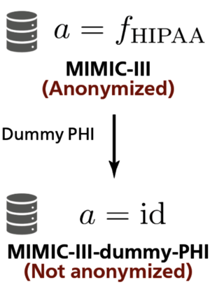

# KART: Parameterization of Privacy Leakage Scenarios from Pre-trained Language Models
This is an implementation of our paper "[KART: Parameterization of Privacy Leakage Scenarios from Pre-trained Language Models](https://arxiv.org/abs/2101.00036)."

## Usage
### 0. Requirements

- Python 3.6.4
- Make sure that `$HOME` is set to environment variable `$PYTHONPATH`.

### 1. How to make MIMIC-III-dummy-PHI



We simulate privacy leakage from clinical records using **MIMIC-III-dummy-PHI**.

MIMIC-III-dummy-PHI is made by embedding pieced of dummy protected health information (PHI) in [MIMIC-III](https://www.nature.com/articles/sdata201635) corpus.

#### 1-1. Install dependencies

To install using `venv` module, use the following commands:

```sh
# Clone Repository
cd ~
git clone git@github.com:yutanakamura-tky/kart.git
cd ~/kart

# Install dependencies
python -m venv .venv
source .venv/source/activate
pip install -r requirements.txt
```


To install using Poetry, use the following commands:

```sh
# Install Poetry
curl -sSL https://raw.githubusercontent.com/python-poetry/poetry/master/get-poetry.py > ~/get-poetry.py
cd ~
python get-poetry.py --version  1.1.4
poetry config virtualenvs.in-project true

# Clone Repository
cd ~
git clone git@github.com:yutanakamura-tky/kart.git
cd ~/kart

# Activate virtual environment & install dependencies
poetry shell
poetry install
```


#### 1-2. Make MIMIC-III-dummy-PHI

First, get `NOTEEVENTS.csv.gz` in MIMIC-III version 1.4 [here](https://physionet.org/content/mimiciii/1.4/) and place it in `corpus` directory.

```
mv /path/to/NOTEEVENTS.csv.gz ~/kart/corpus
cd ~/kart/corpus
gunzip NOTEEVENTS.csv.gz
```

Then run `make_mimic_iii_dummy_phi.sh`. Make sure that you are in the virtual environment:

```
cd ~/kart/src
bash make_mimic_iii_dummy_phi.sh
```

### 2. How to pre-train BERT model
#### 2-1. Convert MIMIC-III to BERT pre-training data (tfrecords format) 
```
cd ~/kart/src
bash make_pretraining_data.sh
```

#### 2-2. Pre-train BERT model
To pre-train BERT model from scratch, use this command:
```
cd ~/kart/src
bash pretrain_bert_from_scratch.sh
```

To pre-train BERT model from BERT-base-uncased model, use this command:
```
cd ~/kart/src
# Download BERT-base-uncased model by Google Research
bash get_google_bert_model.sh
bash pretrain_bert_from_bert_base_uncased.sh
```

## Citation
Please cite our arXiv preprint:

```
@misc{kart,
Author = {Yuta Nakamura and Shouhei Hanaoka and Yukihiro Nomura and Naoto Hayashi and Osamu Abe and Shuntaro Yada and Shoko Wakamiya and Eiji Aramaki},
Title = {KART: Parameterization of Privacy Leakage Scenarios from Pre-trained Language Models},
Year = {2020},
Eprint = {arXiv:2101.00036},
}
```
